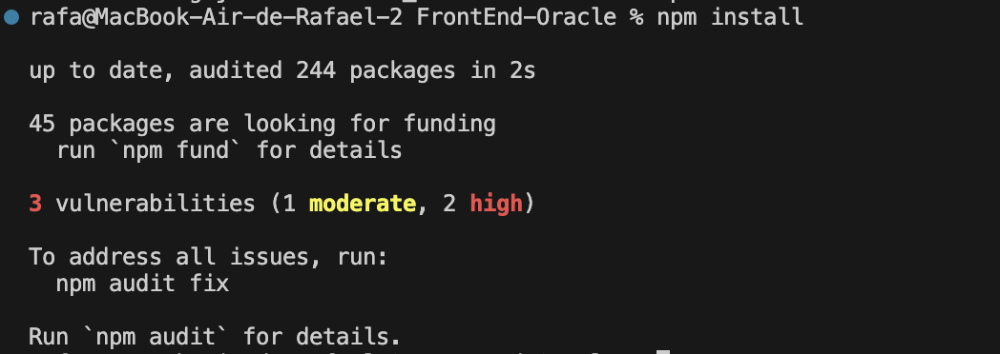
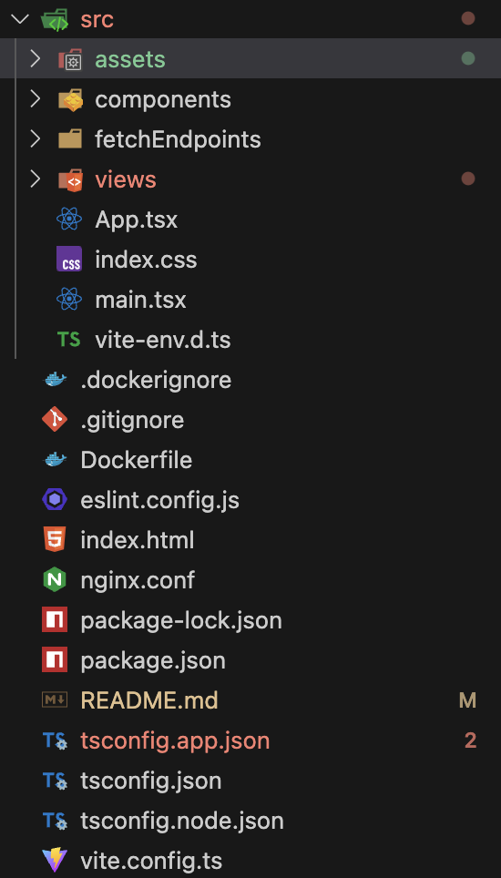
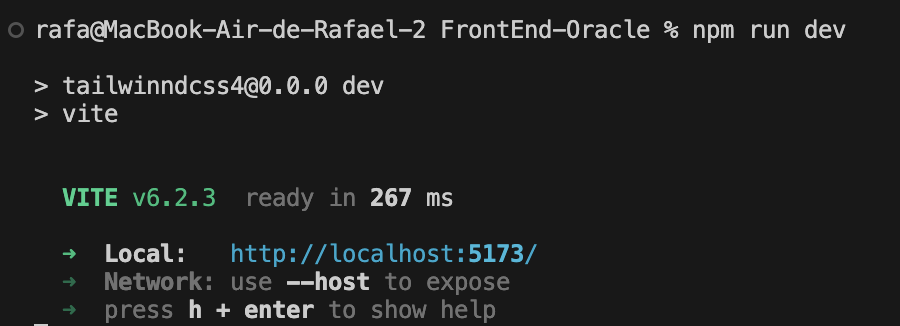
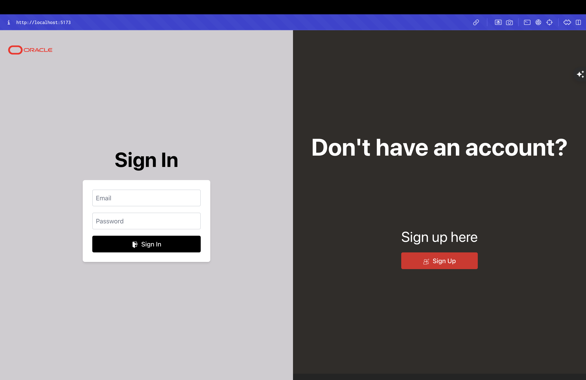
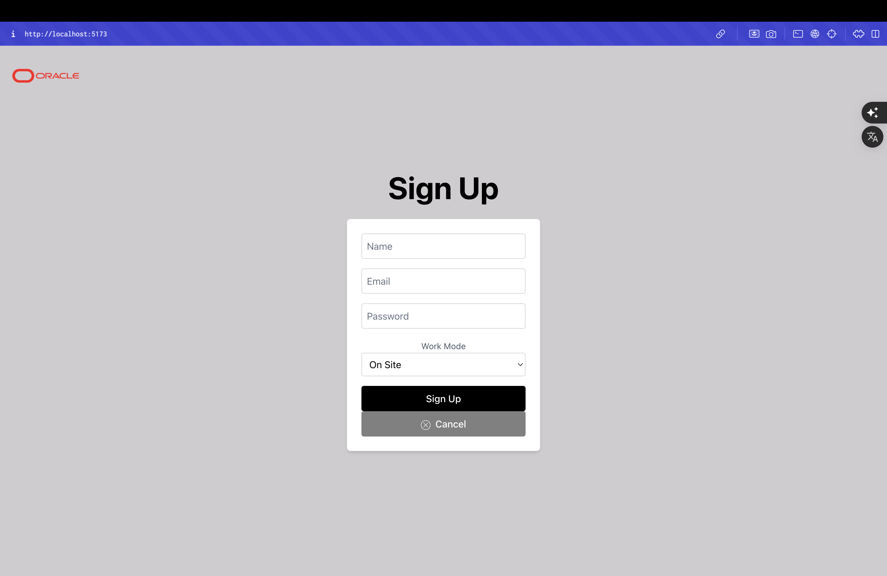
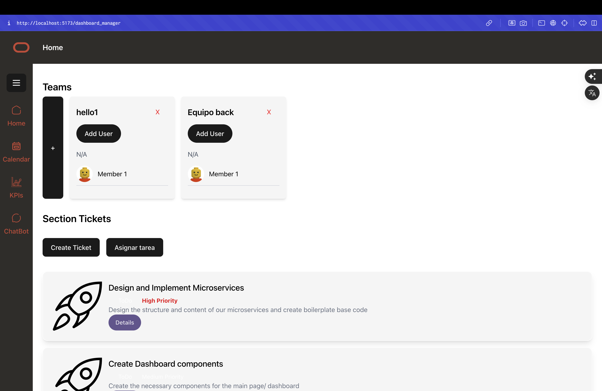

# Oracle Task Manager - FrontEnd

Este repositorio contiene la interfaz gráfica de usuario (Frontend) del sistema **Oracle Task Manager**.

## Requisitos previos

- Node.js (versión 18 o superior recomendada)
- npm o yarn
- Git

## Clonar el repositorio

```bash
git clone https://github.com/OracleTaskManager/FrontEnd.git
cd FrontEnd
```

## Instalación de dependencias

Usa el gestor de paquetes de tu preferencia:

### Con npm:

```bash
npm install
```

### Con yarn:

```bash
yarn install
```

## Ejecutar el proyecto en local

```bash
npm start
```

o

```bash
yarn start
```

La aplicación se ejecutará por defecto en:

```
http://localhost:3000
```

> ⚠️ Asegúrate de que los microservicios (`AuthService`, `TaskService`, `FileService`, etc.) estén corriendo o accesibles para que las funcionalidades estén disponibles.

## Estructura básica del proyecto

```
FrontEnd/
├── public/
├── src/
│   ├── components/
│   ├── views/
│   ├── services/
│   ├── App.tsx
│   └── main.tsx
├── package.json
└── README.md
```

## Construir para producción

```bash
npm run build
```

o

```bash
yarn build
```

Esto generará una carpeta `/build` lista para desplegar en un servidor estático.

## Notas adicionales

- No se requiere ninguna clave o configuración especial para correr el frontend.
- Si necesitas conectarte a APIs en otro dominio (como producción), asegúrate de actualizar las URLs base en el archivo de configuración o servicios (`src/services/api.js`, `src/constants.js`, etc.).

## Evidencia del entorno local

A continuación se muestran capturas de pantalla que evidencian que el proyecto puede ejecutarse correctamente en un entorno local.

### 1. Instalación de dependencias sin errores



### 2. Estructura del proyecto en VS Code



### 3. Proyecto ejecutándose localmente (`npm run dev`)



### 4. Interfaz gráfica cargada en el navegador





---
